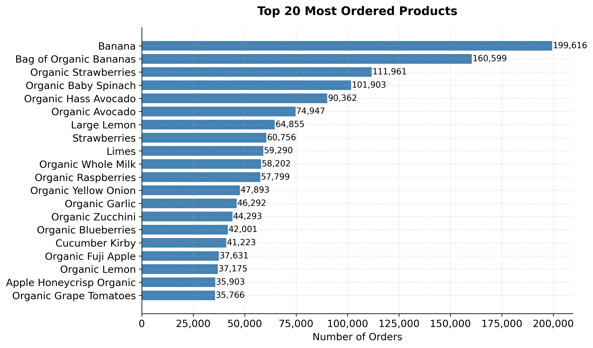
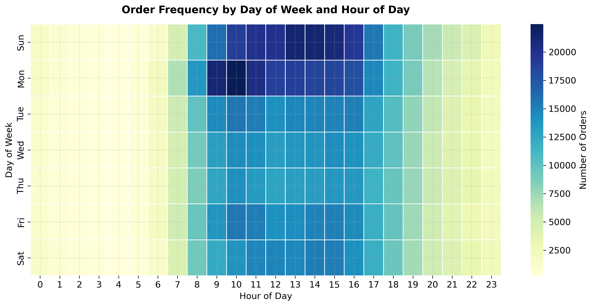
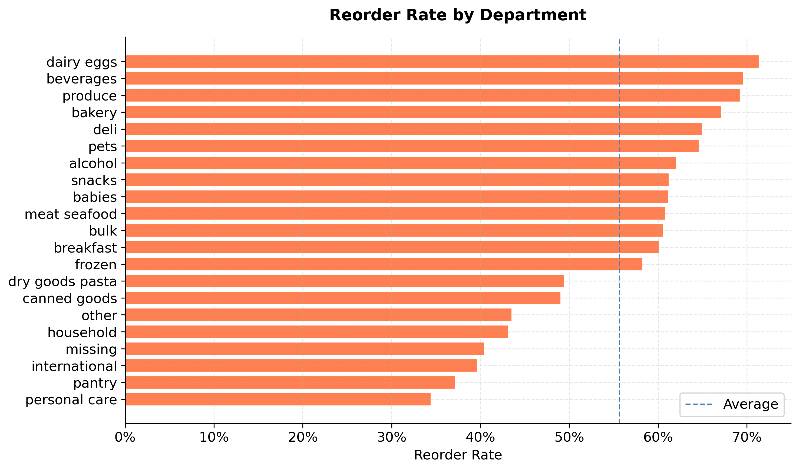
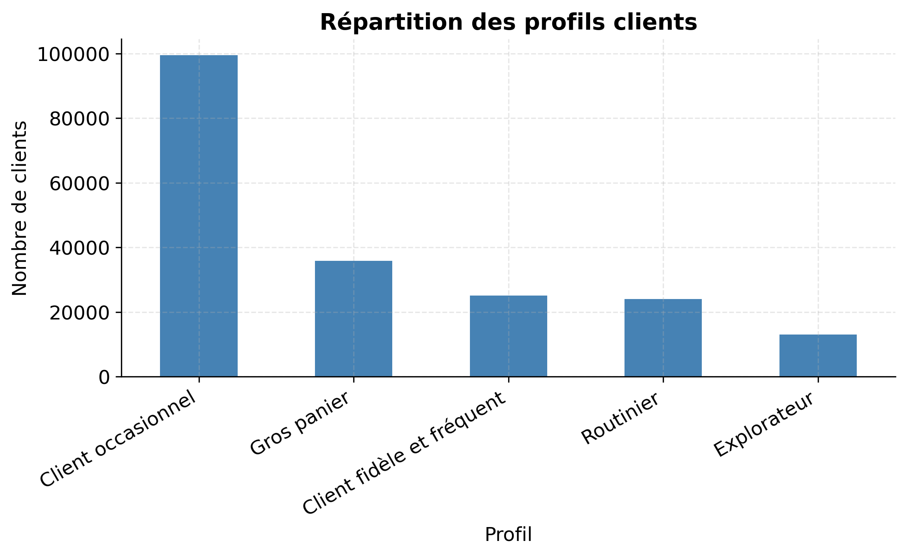
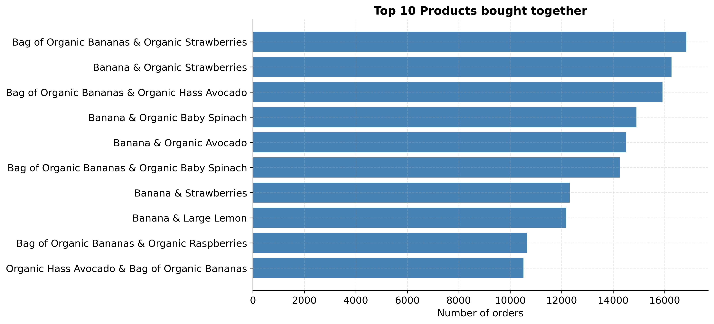
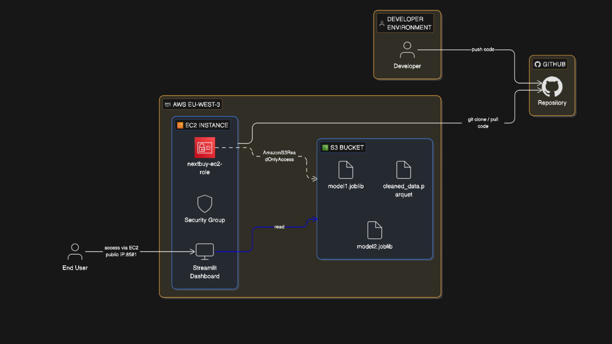

# NextBuy — From Raw Data to Smart Decisions

**Team:** Léo Bellard · Pornraksa Suksawaeng · Mathis Monnin  
**School:** EPITECH Montpellier — Bachelor Computer Science, Year 1 (B1)  
**Duration:** 10 days  

[](https://www.python.org/)
[](https://pandas.pydata.org/)
[](https://scikit-learn.org/)
[](https://xgboost.readthedocs.io/)
[](https://streamlit.io/)
[](https://aws.amazon.com/)

---

## Overview

NextBuy is an end-to-end retail analytics project. Starting from 14 million raw purchase records provided by Epitech, we built a complete data pipeline, answered 11 business questions through exploratory analysis, trained two machine learning models, and deployed everything in an interactive dashboard on AWS.

---

## Project Structure

```
nextbuy/
├── dashboard/
│   ├── 01_Dashboard.py          # Main page — KPIs, charts, AI analysis
│   ├── utils.py                 # Shared data loader with module-level cache
│   └── pages/
│       ├── 02_Analysis.py       # Deep EDA — Q7, Q8, Q9, Q11
│       └── 03_Models.py         # Live ML predictions — Model 1 & 2
├── figures/                     # gitignored — charts exported by notebooks
│   ├── q1_bestsellers.png
│   ├── q2_order_heatmap.png
│   ├── q3_correlation_heatmap.png
│   ├── q4_customer_profiles.png
│   ├── q5_produts_bought_together.png
│   ├── q6_reorder_by_department.png
│   ├── q7_reorder_vs_days_since_prior.png
│   ├── q8_organic_distribution.png
│   ├── q9_first_product_bestsellers.png
│   ├── q10_cart_size_correlation_heatmap.png
│   ├── q10_cart_size_relationships.png
│   └── q11_reorder_by_hour.png
├── models/                      # gitignored — exported after running notebooks
│   ├── model1.joblib            # Reorder classifier (Léo)
│   └── model2.joblib            # Cart size regressor (Mathis)
├── notebooks/
│   ├── 01_cleaning.ipynb        # Pornraksa — load, merge, clean, export
│   ├── 02_eda.ipynb             # Pornraksa — 11 business questions + correlations
│   ├── 03_models_leo.ipynb      # Léo — reorder classifier (XGBoost pipeline)
│   ├── 03_models_mathis.ipynb   # Mathis — cart size regressor (RF pipeline)
│   ├── 04_bonus.ipynb           # Léo + Mathis — product association rules (Apriori)
│   ├── 04_bonus2.ipynb          # Léo + Mathis — customer segmentation (KMeans)
│   └── notebook.ipynb           # Final merged notebook for submission
├── .env.example                 # Environment variable template
├── .gitignore
├── CONTRIBUTING.md              # Git workflow for the team
├── README.md
└── requirements.txt
```

---

## Quick Start

### 1. Clone the repository

```bash
git clone https://github.com/PornraksaSuksawaeng/nextbuy-data-analysis.git
cd nextbuy-data-analysis
```

### 2. Create a virtual environment

```bash
python3 -m venv .venv
source .venv/bin/activate       # macOS / Linux
.venv\Scripts\activate          # Windows
```

### 3. Install dependencies

```bash
pip install -r requirements.txt
```

### 4. Configure environment variables

```bash
cp .env.example .env
# Edit .env and fill in your values
```

### 5. Add the dataset

Place the dataset files provided by Epitech in a `data/` folder at the root:

```
data/
├── orders.csv
├── order_products.csv
├── products.csv
├── aisles.csv
└── departments.csv
```

### 6. Run notebooks in order

```bash
jupyter notebook
# Run: 01_cleaning → 02_eda → 03_models_leo → 03_models_mathis → 04_bonus → 04_bonus2
```

### 7. Launch the dashboard

```bash
streamlit run dashboard/01_Dashboard.py
```

Opens at `http://localhost:8501`

---

## Notebooks

### 01 — Data Cleaning (`01_cleaning.ipynb`)
**Owner:** Pornraksa Suksawaeng

Loads the 5 raw CSV files with explicit dtype specifications to avoid memory crashes, merges them in order of size (`order_products` → `products` → `aisles` → `departments` → `orders`), then applies a reproducible cleaning pipeline:

- Drop rows with unmatched `product_id` or `order_id`
- Fill missing aisle names by re-reading `aisles.csv`
- Handle `days_since_prior_order` NaN values (expected on first orders)
- Remove duplicates and verify `add_to_cart_order` sequence integrity
- Export `cleaned_data.csv` locally or to S3 depending on `USE_S3`

---

### 02 — Exploratory Data Analysis (`02_eda.ipynb`)
**Owner:** Pornraksa Suksawaeng

Answers 11 business questions with varied visualisations. Each chart is followed by a written analysis and exported to `figures/`.

| Question | Chart type | Key finding |
|---|---|---|
| Q1 — Best sellers | Horizontal bar | Banana leads with 199K orders |
| Q2 — When do customers order? | Heatmap (day × hour) | Peak: Sunday–Monday 9h–16h |
| Q3 — Reorder correlations | Correlation heatmap | Feature selection for Model 1 |
| Q6 — Reorder rate by department | Horizontal bar | Dairy & eggs highest at 72% |
| Q7 — Reorder vs days since last order | Scatter + trend line | Rate declines linearly with delay |
| Q8 — Organic proportion by department | Stacked bar | Produce: 54% organic |
| Q9 — First item added to cart | Horizontal bar | Banana most common first item |
| Q10 — Cart size correlations | Heatmap + scatter | Feature selection for Model 2 |
| Q11 — Reorder rate by hour | Line chart | Peak at 6h–7h (habitual shoppers) |

**Best sellers (Q1)**


**Order heatmap by day × hour (Q2)**


**Reorder rate by department (Q6)**


---

### 03 — Reorder Classifier (`03_models_leo.ipynb`)
**Owner:** Léo Bellard

Predicts whether a customer will reorder a specific product. Train/test split is done by `user_id` to prevent data leakage across users.

**Pipeline:** `SimpleImputer(median)` → `XGBClassifier(n_estimators=200, max_depth=8)`

**Features (16):** cart position, aisle, department, order number, day of week, hour of day, days since prior order, user ID, product ID, user total orders, user avg days between orders, product order count, product avg cart position, product reorder rate, user-product order count, user-product last order number

**Export:** `models/model1.joblib`

---

### 03 — Cart Size Regressor (`03_models_mathis.ipynb`)
**Owner:** Mathis Monnin

Predicts how many items a customer will add to their next order. All user history features are computed with `.shift(1).expanding().mean()` to prevent data leakage.

**Pipeline:** `StandardScaler` → `RandomForestRegressor` (tuned with `GridSearchCV`, cv=3)

**Features (10):** `order_dow`, `order_hour_of_day`, `days_since_prior_order`, `order_number`, `user_avg_basket`, `user_avg_basket3`, `user_std_basket`, `user_last_basket`, `user_reorder_rate`, `user_n_orders_so_far`

**Export:** `models/model2.joblib`

---

### 04 — Bonus Questions

**Q5 — Association Rules (`04_bonus.ipynb`)** — Léo Bellard + Mathis Monnin  
Identifies product pairs frequently bought together using the Apriori algorithm (`mlxtend`). Results are filtered by lift and visualised as a horizontal bar chart.

**Q4 — Customer Segmentation (`04_bonus2.ipynb`)** — Léo Bellard + Mathis Monnin  
KMeans clustering on user-level aggregated features to identify customer profiles. Features are normalised with `StandardScaler` before clustering.

**Customer profiles — KMeans segmentation (Q4)**


**Top 10 products bought together — Apriori (Q5)**


---

## Dashboard

### Page 1 — Dashboard (`01_Dashboard.py`)
- Department + aisle cascading sidebar filters
- 5 KPI cards: total orders, unique products, avg cart size, reorder rate, top product
- Tab 1: Top N best-selling products (Q1)
- Tab 2: Order heatmap by day × hour (Q2)
- Tab 3: Reorder rate by department (Q6)
- Global AI Analysis via Groq API — generates cross-dataset insights in streaming

### Page 2 — Analysis (`pages/02_Analysis.py`)
- Q7: Reorder rate vs days since prior order (scatter + trend line)
- Q8: Organic proportion by department (stacked bar)
- Q9: First item added to cart (bar chart with slider)
- Q11: Reorder rate by hour of day (line chart)

### Page 3 — Models (`pages/03_Models.py`)
- Model 1: 5 user-facing sliders → Yes/No reorder prediction
- Model 2: 10 sliders → predicted cart size vs dataset average

---

## Machine Learning Models

Both models are exported as **sklearn Pipelines** — no manual preprocessing needed at prediction time.

| Model | File | Algorithm | Target | Split strategy |
|---|---|---|---|---|
| Reorder Classifier | `model1.joblib` | XGBoost | `reordered` (0/1) | By `user_id` |
| Cart Size Regressor | `model2.joblib` | Random Forest | items per order | Random 80/20 |

---

## Cloud Deployment (AWS)

The dashboard is deployed on AWS in the `eu-west-3` (Paris) region.



```
GitHub
└── dashboard code, notebooks, requirements.txt

AWS S3
├── cleaned_data.parquet   (optimised — ~300MB)
├── cleaned_data.csv       (fallback — 1.2GB)
├── model1.joblib
└── model2.joblib

AWS EC2 (t3.xlarge — 4 vCPU, 16GB RAM)
└── streamlit run dashboard/01_Dashboard.py --server.port 8501 --server.address 0.0.0.0
    ├── USE_S3=true → reads all files from S3 via s3fs
    └── IAM Role nextbuy-ec2-role → no hardcoded credentials
```

Set `USE_S3=true` in `.env` to switch from local files to S3. All notebooks and dashboard pages support both modes transparently via the same `storage_options` pattern.

---

## Environment Variables

Copy `.env.example` to `.env` and fill in your values:

```
USE_S3=false                  # true on EC2, false locally
S3_BUCKET=your-bucket-name
AWS_ACCESS_KEY_ID=...         # not needed on EC2 (IAM Role)
AWS_SECRET_ACCESS_KEY=...     # not needed on EC2 (IAM Role)
AWS_REGION=eu-west-3
GROQ_API_KEY=...              # optional — AI analysis feature
```

On EC2, only `USE_S3`, `S3_BUCKET`, `AWS_REGION`, and `GROQ_API_KEY` are needed. The IAM Role handles S3 authentication automatically — no keys required on the server.

---

## Technical Stack

| Area | Tools |
|---|---|
| Data manipulation | Python 3.12, Pandas, NumPy |
| Visualisation | Matplotlib, Seaborn, Plotly |
| Machine learning | scikit-learn, XGBoost |
| Unsupervised ML | KMeans, Apriori (mlxtend) |
| Dashboard | Streamlit |
| AI integration | Groq API (`openai/gpt-oss-120b`) |
| Cloud storage | AWS S3 + s3fs |
| Cloud compute | AWS EC2 |
| Security | AWS IAM Role |
| Model serialisation | joblib |
| Environment | Jupyter, VS Code |

---

## Team

| Name | Role | Contributions |
|---|---|---|
| **Pornraksa Suksawaeng** | Lead Developer | Data cleaning, EDA (11 questions), dashboard (3 pages), AWS deployment |
| **Léo Bellard** | ML Lead | Reorder classifier (XGBoost), bonus Q4 & Q5 |
| **Mathis Monnin** | ML Support | Cart size regressor (Random Forest + GridSearchCV), bonus Q4 & Q5 |

---

*Dataset provided by Epitech Montpellier — B1 Data Science Project 2026*